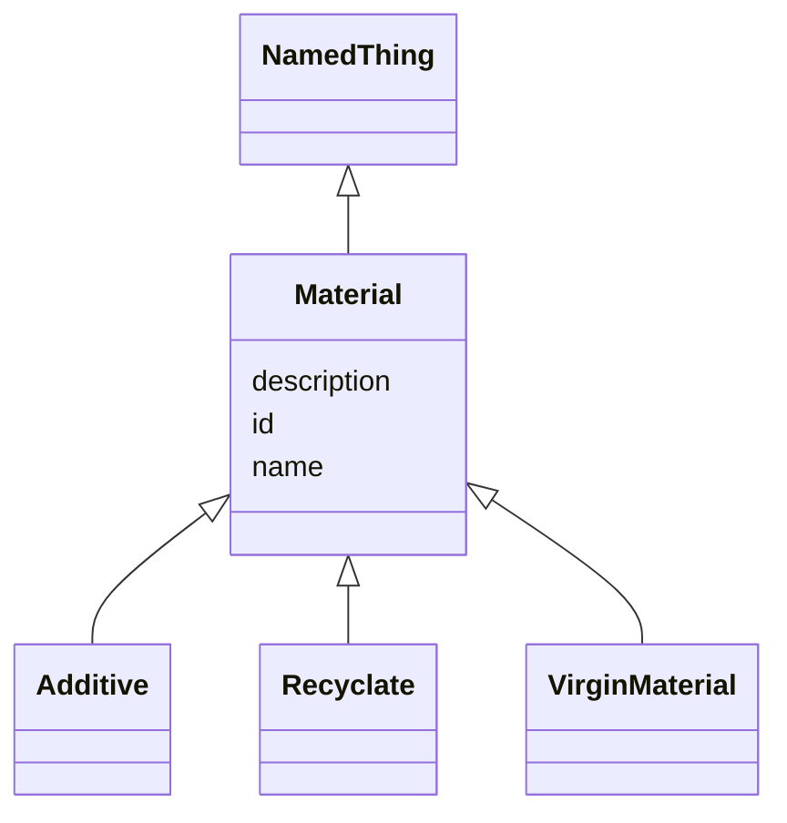

# Class: Material


_The material may contain one or more distinguish additives, recyclates or virgin materials._


URI: [kioptipack_schema:Material](https://w3id.org/Fraunhofer/kioptipack-schema/Material)





## Inheritance
* [NamedThing](NamedThing.md)
    * **Material**
        * [Additive](Additive.md)
        * [Recyclate](Recyclate.md)
        * [VirginMaterial](VirginMaterial.md)


## Slots

| Name | Cardinality and Range | Description | Inheritance |
| ---  | --- | --- | --- |
| [id](id.md) | 1..1 <br/> [Uriorcurie](Uriorcurie.md) | A unique identifier for a thing | [NamedThing](NamedThing.md) |
| [name](name.md) | 0..1 <br/> [String](String.md) | A human-readable name for a thing | [NamedThing](NamedThing.md) |
| [description](description.md) | 0..1 <br/> [String](String.md) | A human-readable description for a thing | [NamedThing](NamedThing.md) |


## Identifier and Mapping Information


### Schema Source


* from schema: https://w3id.org/Fraunhofer/kioptipack-schema


## Mappings

| Mapping Type | Mapped Value |
| ---  | ---  |
| self | kioptipack_schema:Material |
| native | kioptipack_schema:Material |


## LinkML Source

<!-- TODO: investigate https://stackoverflow.com/questions/37606292/how-to-create-tabbed-code-blocks-in-mkdocs-or-sphinx -->

### Direct

<details>
```yaml
name: Material
description: The material may contain one or more distinguish additives, recyclates
  or virgin materials.
from_schema: https://w3id.org/Fraunhofer/kioptipack-schema
is_a: NamedThing

```
</details>

### Induced

<details>
```yaml
name: Material
description: The material may contain one or more distinguish additives, recyclates
  or virgin materials.
from_schema: https://w3id.org/Fraunhofer/kioptipack-schema
is_a: NamedThing
attributes:
  id:
    name: id
    description: A unique identifier for a thing
    from_schema: https://w3id.org/Fraunhofer/kioptipack-schema
    rank: 1000
    slot_uri: schema:identifier
    identifier: true
    alias: id
    owner: Material
    domain_of:
    - NamedThing
    range: uriorcurie
    required: true
  name:
    name: name
    description: A human-readable name for a thing
    from_schema: https://w3id.org/Fraunhofer/kioptipack-schema
    rank: 1000
    slot_uri: schema:name
    alias: name
    owner: Material
    domain_of:
    - NamedThing
    - Additive
    - Recyclate
    - Virgin Material
    range: string
  description:
    name: description
    description: A human-readable description for a thing
    from_schema: https://w3id.org/Fraunhofer/kioptipack-schema
    rank: 1000
    slot_uri: schema:description
    alias: description
    owner: Material
    domain_of:
    - NamedThing
    - Additive
    - Recyclate
    - Virgin Material
    range: string

```
</details>