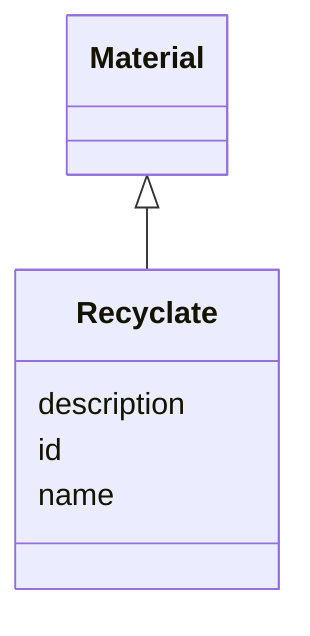

# Class: Recyclate


_This class contain different sub classes to make additives more specific. In general, there are no instances of this class, but from the subclass(es)._


URI: [kioptipack_schema:Recyclate](https://w3id.org/Fraunhofer/kioptipack-schema/Recyclate)





## Inheritance
* [NamedThing](NamedThing.md)
    * [Material](Material.md)
        * **Recyclate**


## Slots

| Name | Cardinality and Range | Description | Inheritance |
| ---  | --- | --- | --- |
| [name](name.md) | 0..1 <br/> [String](String.md) | A human-readable name for a thing | direct |
| [description](description.md) | 0..1 <br/> [String](String.md) | A human-readable description for a thing | direct |
| [id](id.md) | 1..1 <br/> [Uriorcurie](Uriorcurie.md) | A unique identifier for a thing | [NamedThing](NamedThing.md) |


## Identifier and Mapping Information


### Schema Source


* from schema: https://w3id.org/Fraunhofer/kioptipack-schema


## Mappings

| Mapping Type | Mapped Value |
| ---  | ---  |
| self | kioptipack_schema:Recyclate |
| native | kioptipack_schema:Recyclate |


## LinkML Source

<!-- TODO: investigate https://stackoverflow.com/questions/37606292/how-to-create-tabbed-code-blocks-in-mkdocs-or-sphinx -->

### Direct

<details>
```yaml
name: Recyclate
description: This class contain different sub classes to make additives more specific.
  In general, there are no instances of this class, but from the subclass(es).
from_schema: https://w3id.org/Fraunhofer/kioptipack-schema
is_a: Material
slots:
- name
- description

```
</details>

### Induced

<details>
```yaml
name: Recyclate
description: This class contain different sub classes to make additives more specific.
  In general, there are no instances of this class, but from the subclass(es).
from_schema: https://w3id.org/Fraunhofer/kioptipack-schema
is_a: Material
attributes:
  name:
    name: name
    description: A human-readable name for a thing
    from_schema: https://w3id.org/Fraunhofer/kioptipack-schema
    rank: 1000
    slot_uri: schema:name
    alias: name
    owner: Recyclate
    domain_of:
    - NamedThing
    - Additive
    - Recyclate
    - Virgin Material
    range: string
  description:
    name: description
    description: A human-readable description for a thing
    from_schema: https://w3id.org/Fraunhofer/kioptipack-schema
    rank: 1000
    slot_uri: schema:description
    alias: description
    owner: Recyclate
    domain_of:
    - NamedThing
    - Additive
    - Recyclate
    - Virgin Material
    range: string
  id:
    name: id
    description: A unique identifier for a thing
    from_schema: https://w3id.org/Fraunhofer/kioptipack-schema
    rank: 1000
    slot_uri: schema:identifier
    identifier: true
    alias: id
    owner: Recyclate
    domain_of:
    - NamedThing
    range: uriorcurie
    required: true

```
</details>